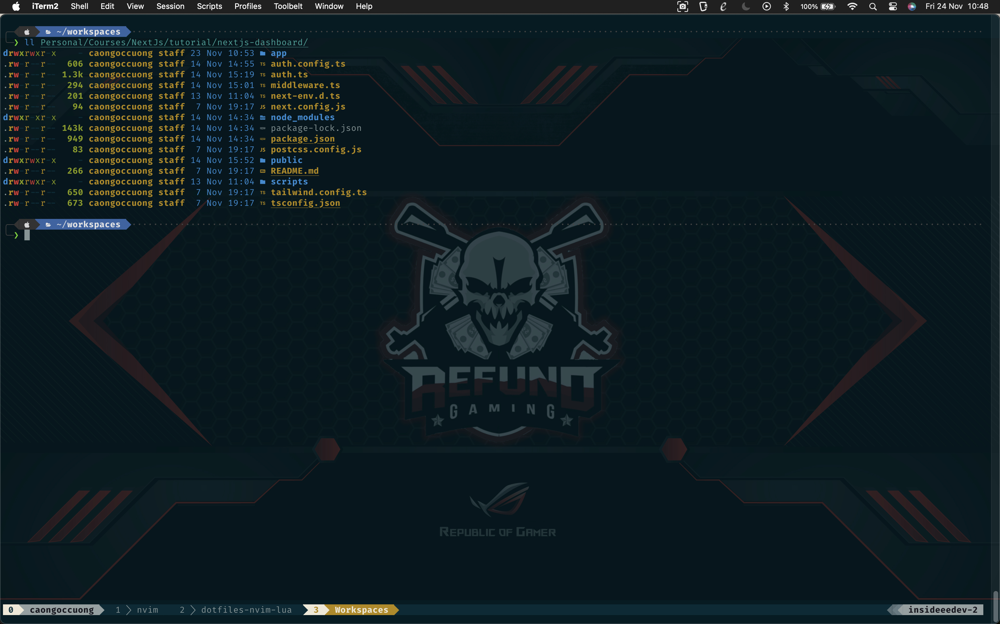
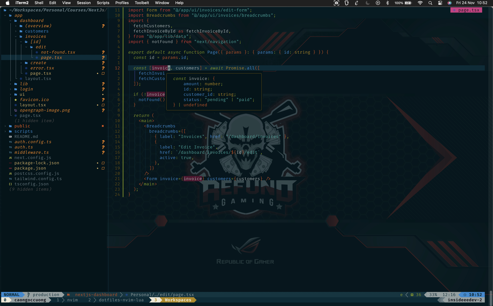
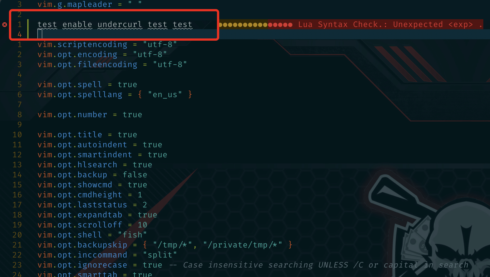

# insideee.dev's dotfiles

**Warning**: Don’t blindly use my settings unless you know what that entails. Use at your own risk!

## Contents

- vim (NeoVim) config
- tmux config
- git config
- karabiner mapping
- fish config

## Karabiner element application

I use Karabiner to customize some keys for my keyboard to make vim easier for me to use.

To install: `brew install --cask karabiner-elements`

Search in the registry:

- [Vim style escape key mapping](https://ke-complex-modifications.pqrs.org/?q=escape%20to%20ctrl%20%2B%20%5B)
- [Vim style arrows](https://ke-complex-modifications.pqrs.org/?q=vim%20style%20arrows)


## Neovim setup

### Requirements

- Neovim >= **0.9.0** (needs to be built with **LuaJIT**)
- Git >= **2.19.0** (for partial clones support)
- [LazyVim](https://www.lazyvim.org/)
- a [Nerd Font](https://www.nerdfonts.com/)(v3.0 or greater) **_(optional, but needed to display some icons)_**
- [lazygit](https://github.com/jesseduffield/lazygit) **_(optional)_**
- a **C** compiler for `nvim-treesitter`. See [here](https://github.com/nvim-treesitter/nvim-treesitter#requirements)
- for [telescope.nvim](https://github.com/nvim-telescope/telescope.nvim) **_(optional)_**
  - **live grep**: [ripgrep](https://github.com/BurntSushi/ripgrep)
  - **find files**: [fd](https://github.com/sharkdp/fd)
- a terminal that support true color and *undercurl*:
  - [kitty](https://github.com/kovidgoyal/kitty) **_(Linux & Macos)_**
  - [wezterm](https://github.com/wez/wezterm) **_(Linux, Macos & Windows)_**
  - [alacritty](https://github.com/alacritty/alacritty) **_(Linux, Macos & Windows)_**
  - [iterm2](https://iterm2.com/) **_(Macos)_**
- [Solarized Osaka](https://github.com/craftzdog/solarized-osaka.nvim)

## Shell setup (macOS & Linux)

- [Fish shell](https://fishshell.com/)
- [Fisher](https://github.com/jorgebucaran/fisher) - Plugin manager.
- [Tide](https://github.com/IlanCosman/tide) - Shell theme. Use version 5: `fisher install ilancosman/tide@v5`
- [Nerd fonts](https://github.com/ryanoasis/nerd-fonts) - Powerline-patched fonts. I use Dank Mono.
- [Eza](https://github.com/eza-community/eza) - `ls` replacement.

## Enable `undercurl` in iterm2 step by step:

1. First thing first, export your TERM on your _~/.zshrc_.
   > Source your ~/.zshrc is necessary.

```
  export TERM="xterm-256color"
  [[ -n $TMUX ]] && export TERM="screen-256color"
```

2. Your `.vimrc` or `init.lua` or maybe in `~/.config/nvim/lua/config/options.lua` like my config need to add these two options.

```
  vim.opt.spell = true
  vim.opt.spelllang = { 'en_us' }
```

3. Next, use _infocmp_ to generate terminal description:  
   Open a terminal and run the following command in fish:

```
  infocmp > /tmp/$TERM.ti
```

4. Edit the terminal description file:  
   Open the file `/tmp/$TERM.ti` in a text editor. Find the line that contains smul=\E[4m, and add a new line after it:

```
 smul=\E[4m,
 Smulx=\E[4:%p1%dm,
```

Save the changes and close the file. 5. Compile the modified terminal description:

```
 tic -x /tmp/$TERM.ti
```

6. Restart your terminal.
   

### Iterm2 snapshot configurations


## How to use

Let see this tutorials Takuya's blog:

1. [Blogpost - my-vim-setup-to-speed-up-javascript-coding-for-my-electron-and-react-native-apps](https://dev.to/craftzdog/my-vim-setup-to-speed-up-javascript-coding-for-my-electron-and-react-native-apps-4ebp)
2. [Blogpost - a-productive-command-line-git-workflow-for-indie-app-developers](https://dev.to/craftzdog/a-productive-command-line-git-workflow-for-indie-app-developers-k7d)

## About me

- [Linkedin](https://www.linkedin.com/in/cuong-cao-ngoc-792992229/)
- [Github](https://github.com/CaoNgocCuong?tab=repositories)
- [Facebook](https://www.facebook.com/tony.cuong.39142/)
- _Gmail_: `insideee.dev@gmail.com`
