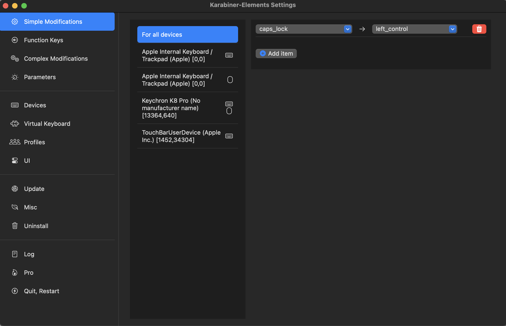

# insideee.dev's dotfiles

**Warning**: Don’t blindly use my settings unless you know what that entails. Use at your own risk!

## Contents

- vim (NeoVim) config
- tmux config
- git config
- karabiner mapping
- fish config

## Karabiner element application

I use Karabiner to customize some keys for my keyboard to make vim easier for me to use.

To install: `brew install --cask karabiner-elements`

Search in the registry:

- [Vim style escape key mapping](https://ke-complex-modifications.pqrs.org/?q=escape%20to%20ctrl%20%2B%20%5B)
- [Vim style arrows](https://ke-complex-modifications.pqrs.org/?q=vim%20style%20arrows)

## Neovim setup

Requires [Neovim](https://neovim.io/) (>= 0.8)

- [wbthomason/packer.nvim](https://github.com/wbthomason/packer.nvim) - A plugin manager for Neovim
- [svrana/neosolarized.nvim](https://github.com/svrana/neosolarized.nvim) - A truecolor, solarized dark colorscheme
- [nvim-lualine/lualine.nvim](https://github.com/nvim-lualine/lualine.nvim) - A blazing fast and easy to configure Neovim statusline written in Lua
- [onsails/lspkind-nvim](https://github.com/onsails/lspkind-nvim) - VSCode-like pictograms
- [L3MON4D3/LuaSnip](https://github.com/L3MON4D3/LuaSnip) - Snippet Engine for Neovim written in Lua
- [hrsh7th/cmp-nvim-lsp](https://github.com/hrsh7th/cmp-nvim-lsp) - nvim-cmp source for neovim's built-in LSP
- [hrsh7th/cmp-buffer](https://github.com/hrsh7th/cmp-buffer) - nvim-cmp source for buffer words
- [hrsh7th/nvim-cmp](https://github.com/hrsh7th/nvim-cmp) - A completion engine plugin for neovim written in Lua
- [neovim/nvim-lspconfig](https://github.com/neovim/nvim-lspconfig) - A collection of configurations for Neovim's built-in LSP
- [jose-elias-alvarez/null-ls.nvim](https://github.com/jose-elias-alvarez/null-ls.nvim) - Use Neovim as a language server to inject LSP diagnostics, code actions, and more via Lua.
- [williamboman/mason.nvim](https://github.com/williamboman/mason.nvim) - Portable package manager for Neovim that runs everywhere Neovim runs. Easily install and manage LSP servers, DAP servers, linters, and formatters
- [williamboman/mason-lspconfig.nvim](https://github.com/williamboman/mason-lspconfig.nvim) - Extension to mason.nvim that makes it easier to use lspconfig with mason.nvim
- [glepnir/lspsaga.nvim](https://github.com/glepnir/lspsaga.nvim) - A light-weight lsp plugin based on neovim's built-in lsp with a highly performant UI
- [nvim-treesitter/nvim-treesitter](https://github.com/nvim-treesitter/nvim-treesitter) - [Treesitter](https://github.com/tree-sitter/tree-sitter) configurations and abstraction layer for Neovim
- [kyazdani42/nvim-web-devicons](https://github.com/kyazdani42/nvim-web-devicons) - Lua `fork` of vim-web-devicons for neovim
- [nvim-telescope/telescope.nvim](https://github.com/nvim-telescope/telescope.nvim) - A highly extendable fuzzy finder over lists
- [nvim-telescope/telescope-file-browser.nvim](https://github.com/nvim-telescope/telescope-file-browser.nvim) - File Browser extension for telescope.nvim
- [windwp/nvim-autopairs](https://github.com/windwp/nvim-autopairs) - Autopairs
- [windwp/nvim-ts-autotag](https://github.com/windwp/nvim-ts-autotag) - Use treesitter to auto close and auto rename html tag
- [norcalli/nvim-colorizer.lua](https://github.com/norcalli/nvim-colorizer.lua) - A high-performance color highlighter
- [akinsho/nvim-bufferline.lua](https://github.com/akinsho/nvim-bufferline.lua) - A snazzy bufferline
- [lewis6991/gitsigns.nvim](https://github.com/lewis6991/gitsigns.nvim) - Git integration for buffers
- [dinhhuy258/git.nvim](https://github.com/dinhhuy258/git.nvim) - A simple clone of the plugin vim-fugitive
- [folke/zen-mode.nvim](https://github.com/folke/zen-mode.nvim) - Distraction-free mode
- [iamcco/markdown-preview.nvim](https://github.com/iamcco/markdown-preview.nvim) - Markdown live preview

## Shell setup (macOS & Linux)

- [Fish shell](https://fishshell.com/)
- [Fisher](https://github.com/jorgebucaran/fisher) - Plugin manager
- [Tide](https://github.com/IlanCosman/tide) - Shell theme. Use version 5: `fisher install ilancosman/tide@v5`
- [Nerd fonts](https://github.com/ryanoasis/nerd-fonts) - Powerline-patched fonts. I use Dank Mono.

### Iterm2 snapshot configurations

## How to use

Let see this tutorials Takuya's blog:

1. [Blogpost - my-vim-setup-to-speed-up-javascript-coding-for-my-electron-and-react-native-apps](https://dev.to/craftzdog/my-vim-setup-to-speed-up-javascript-coding-for-my-electron-and-react-native-apps-4ebp)
2. [Blogpost - a-productive-command-line-git-workflow-for-indie-app-developers](https://dev.to/craftzdog/a-productive-command-line-git-workflow-for-indie-app-developers-k7d)

## About me

- [Linkedin](https://www.linkedin.com/in/cuong-cao-ngoc-792992229/)
- [Github](https://github.com/CaoNgocCuong?tab=repositories)
- [Facebook](https://www.facebook.com/tony.cuong.39142/)
- _Gmail_: `insideee.dev@gmail.com`
